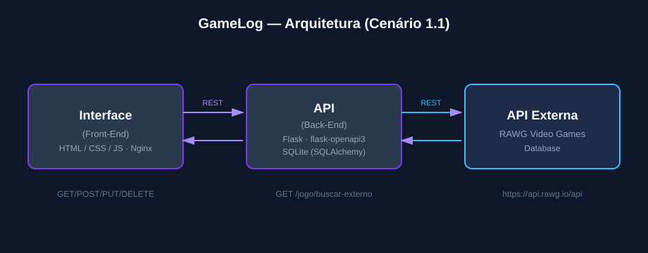

# GameLog — Interface (Front-End)

Interface web do **GameLog**, uma aplicação para registrar quais jogos cada usuário já jogou ou zerou, em qual plataforma e com qual nota pessoal — com capas, data de lançamento, desenvolvedora e nota da crítica (Metascore) trazidas automaticamente da base **RAWG Video Games Database**.

Este repositório é o módulo **Interface** do MVP (Cenário 1.1: Interface ↔ API ↔ API Externa). O módulo da API está no repositório [gamelog-backend](https://github.com/caioalvesp/gamelog-backend).

## Arquitetura



- A **Interface** faz chamadas REST à **API** (GET, POST, PUT e DELETE) para gerenciar usuários, jogos e a coleção de cada usuário.
- A **API** é quem consulta a **API externa (RAWG)** — a Interface nunca fala diretamente com a RAWG. Isso garante que os dados externos sejam sempre tratados no back-end antes de chegar à tela.

## Funcionalidades

- Cadastro e seleção de usuário ativo (autocomplete com busca).
- Busca de um jogo por nome com sugestões vindas tanto da base local quanto da RAWG (com miniatura da capa) — ao escolher uma sugestão da RAWG, capa, data de lançamento, desenvolvedora e nota da crítica são salvas automaticamente junto com o jogo.
- Grade de capas dos jogos (estilo Letterboxd/Backloggd), com busca, filtro por plataforma e por status "zerado".
- Modal de detalhes do jogo: mostra capa e metadados; permite editar a nota pessoal e marcar como zerado.
- Ordenação por nome ou plataforma.

## Rotas da API consumidas

| Rota | Método |
|---|---|
| `/jogos` | `GET`, `POST` |
| `/jogo` | `DELETE` |
| `/jogo/buscar-externo` | `GET` |
| `/usuarios` | `GET` |
| `/usuario` | `POST`, `DELETE` |
| `/usuario/jogo` | `POST`, `PUT` |

## API externa utilizada: RAWG Video Games Database

- **O que fornece**: capa, plataformas, data de lançamento, desenvolvedora e nota da crítica (Metacritic) de praticamente qualquer jogo.
- **Cadastro**: é necessário criar uma conta gratuita em [rawg.io/apidocs](https://rawg.io/apidocs) para obter uma API key gratuita.
- **Licença**: uso gratuito dentro dos limites do plano free (consulte os termos em rawg.io).
- **Endpoint consumido pelo back-end**: `GET https://api.rawg.io/api/games?search={nome}` — a resposta é tratada pelo back-end e reexposta na rota própria `GET /jogo/buscar-externo`, então a Interface nunca acessa a RAWG diretamente.

## Como executar

### Localmente (sem Docker)

Suba primeiro a [API](https://github.com/caioalvesp/gamelog-backend) na porta `8000` (o front-end chama `http://127.0.0.1:8000`). Depois, basta abrir o arquivo `index.html` no navegador.

### Via Docker

```
docker build -t gamelog-frontend .
docker run -p 80:80 gamelog-frontend
```

Acesse [http://localhost](http://localhost) — com a API já rodando (localmente ou em container) na porta `8000`.
